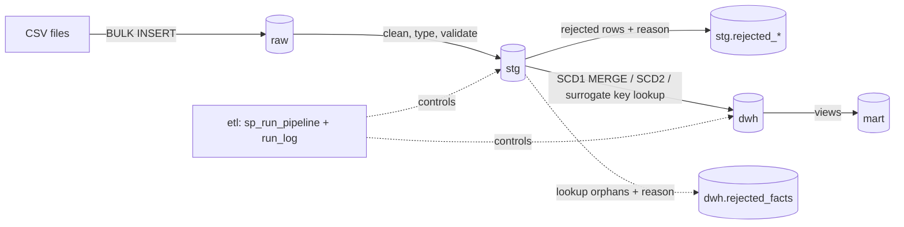

# SQL Server Sales Data Warehouse (Olist)

End-to-end dimensional data warehouse built on SQL Server from raw CSV files:
layered architecture (raw → staging → warehouse → marts), data validation with
reject handling, SCD Type 2 customer dimension, idempotent fact loading, and a
logged pipeline orchestrator. Built on the public
[Olist Brazilian E-Commerce dataset](https://www.kaggle.com/datasets/olistbr/brazilian-ecommerce)
(~99k orders, ~113k order items, 2016–2018).

## Architecture



**Layer contract:** `raw` stores source data 1:1 as text (no interpretation) ·
`stg` applies types, cleaning and validation — every table has a `rejected_*`
twin storing failed rows with a reject reason · `dwh` holds the star schema
(surrogate keys, SCD) · `mart` exposes reporting views only.

**Star schema:** `fact_sales` (grain: **1 row = 1 order item**) with
`dim_customer` (SCD2), `dim_product` (SCD1 via MERGE), `dim_date`;
`order_id` + `order_item_id` kept as degenerate dimensions.

## How to run

1. Run `sql/00_setup.sql` — creates the database, schemas, all tables and
   indexes from scratch (rerunnable).
2. Download the 5 CSV files (see `data/README.md`), set `@data_path` at the top
   of `sql/10_load_raw.sql`, then run it.
3. Run `sql/20_load_stg.sql`, `sql/30_load_dwh.sql`, `sql/40_marts.sql`
   (install procedures and views), then execute the pipeline:
   `EXEC dwh.sp_run_pipeline;` — and verify with `sql/99_tests.sql`.

## Data quality findings

The raw data was profiled before designing the staging layer
(`sql/analysis/profiling.sql`, full write-up in
`docs/data_quality_findings.md`). Data quality is high in the classic sense -
keys are clean, referential integrity holds, numeric and date columns cast
without loss. The significant findings are **structural rather than dirt**:

- **775 orders have no order items** (mostly unavailable/canceled) — at the
  fact grain (order item) they cannot enter `fact_sales`; row-count
  reconciliation accounts for them explicitly.
- **Customers carry two identifiers**: `customer_id` (one per order) vs
  `customer_unique_id` (one per person; ~3k persons have multiple accounts
  (2997). This drives the natural-key choice for `dim_customer`.
- **`order_purchase_timestamp` is the only universally populated timestamp**
  across all order statuses — chosen as the basis for `date_key`. Even
  delivered orders can miss delivery dates  (8 rows).
- 383 order items have `freight_value = 0` — interpreted as free shipping
  (legal value, not dirt): validation mirrors the constraints
  (`price > 0`, `freight_value >= 0`).
- 610 products lack all metadata (verified same-row correlation) — category
  defaulted to `'unknown'` in staging; source column typo (`lenght`) renamed.

## Design decisions (highlights)


- **Validation mirrors DDL** — every `NOT NULL` / `CHECK` in staging has a
  matching validation rule, so bad rows land in `rejected_*` with a reason
  instead of killing the load. Balance holds by construction:
  `raw = stg + rejected`.
- **Rejected tables store rows as they arrived** (raw text types, including
  `_raw` copies of cast-validated values) — quarantine keeps the evidence.
- **Fact loading is insert-only and idempotent** — `NOT EXISTS` on the
  composite key `(order_id, order_item_id)`; re-running the pipeline changes
  nothing. Lookup orphans go to `dwh.rejected_facts` with a reason instead of
  silently disappearing; balance: `stg.order_items = fact + rejected_facts`.
- **SCD2 on `dim_customer`** with intraday-change handling (same-day second
  change corrects the current version in place instead of producing an
  invalid `valid_to < valid_from` row). The dataset is a historical snapshot,
  so the mechanism is verified by simulation.
- **No global transaction around the pipeline** — each step is atomic and
  idempotent on its own; a failed step stops the run (logged in
  `etl.run_log`) without rolling back completed work.
- **NULL is information** — descriptive attributes (city, state) are allowed
  to be NULL; the warehouse never invents realistic-looking defaults.

## Example insights (from mart views)

- Peak sales month: November 2017, 7451 orders
- Top category by items sold: bed_bath_table

## What I'd improve

- Upsert or order-grain handling of status changes (current load is
  insert-only; status reflects the state at load time).
- External orchestration (Dagster) and automated tests 

## Repository layout

```
sql/00_setup.sql          all DDL, rerunnable
sql/10_load_raw.sql       BULK INSERT (parameterized data path)
sql/20_load_stg.sql       5 staging procedures (truncate-and-reload + reject)
sql/30_load_dwh.sql       dimension + fact load procedures
sql/40_marts.sql          reporting views
sql/90_run_pipeline.sql   orchestrator
sql/99_tests.sql          balances, reject distributions, quality checks
sql/analysis/profiling.sql  data profiling (exploration, not part of the build)
```
